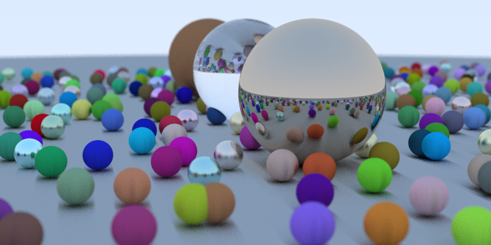

# Sunshine

C# implementation of Peter Shirley's Ray Tracer series of minibooks([first](https://www.amazon.com/Ray-Tracing-Weekend-Minibooks-Book-ebook/dp/B01B5AODD8), [second](https://www.amazon.com/gp/product/B01CO7PQ8C) and [third](https://www.amazon.com/gp/product/B01DN58P8C) book).
My initial goal is to follow the books as closely as possible, while leaving optimizations and refactoring for later.

My intention is to eventually create a functional real time tracer running on the GPU with some rudimentary game engine capabilities(movement, collision, scene graph, etc) while having as few as possible outside dependancies other than MonoGame.

## Current Status

Rudimentary functionality is in place, I wouldn't even call this a toy project at this point.

## Version

### 0.2

* [ ] Impelement content from the second minibook.
* [ ] TBD

### 0.1

* [ ] Implement content from the first minibook.
* [X] add font support.
* [X] add simple GUI overlay for FPS display.
